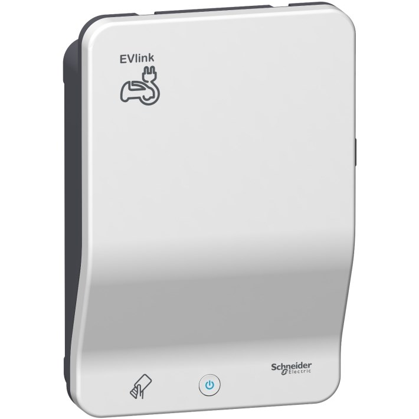
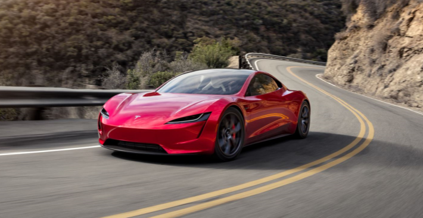

Det ble vedtatt 5. februar 2019 å inngå avtale med Mer (tidligere Grønn kontakt) for installasjon av et slikt anlegg. Denne arbeidet inkluderer infrastruktur til alle 157 plassene og ladeboks til de som ønsket det. Elbilanlegget var klar for bruk 18. september 2019. Dette arbeidet kostet totalt 768.733,75,-

Det ble også søkt om støtte fra Oslo Kommune for arbeidet med ladeinfrastrukturen via [ordningen Oslo kommune har for slik støtte](https://www.oslo.kommune.no/politikk-og-administrasjon/tilskudd-legater-og-stipend/tilskudd-til-ladeinfrastruktur-i-borettslag-og-sameier/#gref). Borettslaget fikk 153.747,- utbetalt i støtte fra Oslo Kommune.

## Hva koster det å lade?

Det er borettslagets styre som setter prisen på lading. Prisen settes basert på prinsippet om at borettslaget ikke skal tjene eller tape penger på elbilladingen. 
Prisen vil derfor settes basert på gjennomsnittlig strømpris med avgifter.
Prisen 1.50,- pr kWh for lading i garasjen. 
I tillegg må hver boenehet inngå avtale med Wattif og må betale abonnementsavgiften pr måned i tilegg til strømprisen i anlegget.

På leverandørens kundeportal og app-en får den enkelte bruker oversikt over sitt forbruk og totale ladestatistikk hos Mer.

Leverandøren er ansvarlig for support til sluttbrukere og er ansvarlig for fakturering

## Om ladeboksen

Ladeboksen som Mer har montert i Hovseterveien 70 er Schneider EVLink EVB1A22P2RI som i utgangspunktet er en lader som gir opptil 22KW lader. I borettslaget er den satt opp i en konfigurasjon som gir opptil 7.2KW lading.

Dette er i utgangspunktet begrenset i strømnettet som finnes på Hovseter. Dette er et såkalt 230 Volts TN nett som begrenser ladeboksen til dette.

Boksen har uttakt for Type 2 kabel som kobles inn i den. (følger typisk med elbilen) . Se video hvordan man starter lading her. (i borettslaget bruker man brikke og ikke kort, i tillegg har vi ikke elsykkelading som boksen på videoen har)

## Hvordan bestiller man?

Ladeboks bestilles direkte fra leverandøren.

