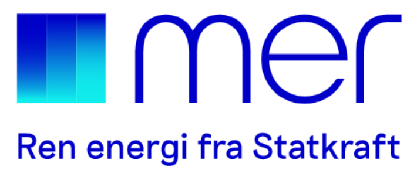
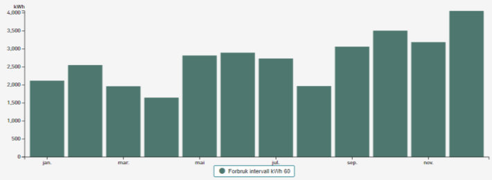
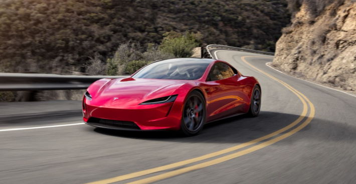

Det ble vedtatt 5. februar 2019 å inngå avtale med Mer (tidligere Grønn kontakt) for installasjon av et slikt anlegg. Denne arbeidet inkluderer infrastruktur til alle 157 plassene og ladeboks til de som ønsket det. Elbilanlegget var klar for bruk 18. september 2019. Dette arbeidet kostet totalt 768.733,75,-

Som del av tilbudet fra Mer, fikk andeler med parkeringsplass i Hovseterveien 70 mulighet til å bestille ladeboks til 19.995,- inkludert montering. Det var 20 boenheter som takket ja til tilbudet i første omgang. Boenheter som ønsker ladeboks på sin plass må nå betale ca 22.500,- for å få montert opp ladeboks. Hver parkeringsplass er forberedt til dette.  

Det ble også søkt om støtte fra Oslo Kommune for arbeidet med ladeinfrastrukturen via [ordningen Oslo kommune har for slik støtte](https://www.oslo.kommune.no/politikk-og-administrasjon/tilskudd-legater-og-stipend/tilskudd-til-ladeinfrastruktur-i-borettslag-og-sameier/#gref). Borettslaget fikk 153.747,- utbetalt i støtte fra Oslo Kommune.

## Hva koster det å lade?

Strømmen til elbilladingen går over et abonnement betalt av borettslaget. Denne utgiften må dekkes av de som bruker strøm til elbilladingen. 

Det er borettslagets styre som setter prisen på lading. Prisen settes basert på prinsippet om at borettslaget ikke skal tjene eller tape penger på elbilladingen. Prisen vil derfor settes basert på [gjennomsnittlig strømpris med avgifter](http://www.ssb.no/elkraftpris/), det påslaget som Mer tar for å drifte anlegget og et lite påslag for å dekke vedlikeholdsavtalen borettslaget har for årlig vedlikehold med OneCo

I første omgang settes prisen til 150øre/kwh. Når styret får mer erfaring med det reelle kostnadsbildet vil dette kunne justeres litt.

I tillegg må hver boenehet inngå avtale med Mer og må betale 39 kr pr måned i tilegg til strømprisen i anlegget. Med avtalen følger det med en ladebrikke for enkel tilgang til egen lader og hele Mers [landsdekkende ladenettverk](https://no.mer.eco/ladekart/) på ca 1500 ladere. Denne avtalen gir også 15% rabatt på hurtigladenettverket til Mer.

På Mers kundeportal Min Side får den enkelte bruker oversikt over sitt forbruk og totale ladestatistikk hos Mer.

Med Flexiladeløsning fra Mer får sluttbrukeren tilgang til 24/7 teknisk support ved behov.

Mer er ansvarlig for support til sluttbrukere og er ansvarlig for fakturering

I 2020 ble det totalt ladet 32525kWh i anlegget.

## Om ladeboksen

Ladeboksen som Mer har montert i Hovseterveien 70 er Schneider EVLink EVB1A22P2RI som i utgangspunktet er en lader som gir opptil 22KW lader. I borettslaget er den satt opp i en konfigurasjon som gir opptil 7.2KW lading.

Dette er i utgangspunktet begrenset i strømnettet som finnes på Hovseter. Dette er et såkalt 230 Volts TN nett som begrenser ladeboksen til dette.

Boksen har uttakt for Type 2 kabel som kobles inn i den. (følger typisk med elbilen) . Se video hvordan man starter lading her. (i borettslaget bruker man brikke og ikke kort, i tillegg har vi ikke elsykkelading som boksen på videoen har)

## Hvordan bestiller man?

For å bestille ladeboks trenger du å fylle ut [dette skjemaet](bestillingskjema.pdf), scanne det og sende på epost til order.no@mer.eco  Prisen er 22.495,-

Mer vil da ordne montering og ladebrikke til deg. Forvent ca 2-4 ukers leveringstid fra man bestiller.

 
## Spørsmål og svar

Les Mer generelle informasjon. 

**Spørsmål:** Hva vil det koste å få elbillader på parkeringsplassen 

**Svar:**  Prisen er 22.495,- for boks og installasjon i garasjen. I tilegg kommer 39,- kr i månedsavgift til Mer og så må du betale for strømmen (for øyeblikket 150øre/kWh)

**Spørsmål:**  Hvordan blir strømforbruket betalt:

**Svar:**  Mer vil sende faktura til beboere med kontrakt.

**Spørsmål:** Hvem gjør installasjon av ladeboks og infrastruktur?

**Svar:**  Det er Sønnico som gjør denne delen av jobben.

**Spørsmål:** Kan man ta med seg ladeboks når man flytter og f.eks benytte i enebolig?

**Svar:**  Ja, det er i  utgangspunktet mulig, men anbefales ikke. Ladeboksen kan monteres i en enebolig.

Det vanlige er vel at den selges med parkeringsplassen og at den har en ekstra verdi.

Arbeidene må utføres av en elektriker, og endringer i anlegget må dokumenteres.

**Spørsmål:** Hva er et lastbalansert anlegg?

**Svar:** Du kan lese en [god forklaring](https://no.mer.eco/nyheter/hjemmelading/hva-er-lastbalansering/) hos Mer.

**Spørsmål:** Hva vil maksimal ladekapasitet for en bil være?

**Svar:** Maksimal ladekapasitet vil være 7360Watt (7.3Kw) . Dette forutsatt at ikke for mange biler lader samtidig. (ved lading av mer enn 7 biler samtidig vil effekten gå ned). 

**Spørsmål:**  Hvor lang tid tar det å lade bilen fra tom til fullt med maksimal ladehastighet? 

**Svar:**  Hvis man har en Audi e-tron med ca 84KWH batterikapasitet så vil det ta 11 timer.

**Spørsmål:**  Hvor kraftig vil anlegget som installers være totalt. 

**Svar:** Anlegget dimmensjoneres for 750A totalt, hvor hver etasje får en strømskinne dimensjonert for 250A. For øyeblikket monteres det en hovesikring på 400A som settes til maks 125A bruk.  125A 230 Volts 3 fasenalegg IT nett gir en maks kapasitet på 49,7 KW. Dette kan teoretisk utvides til 298KW senere (750A)

**Spørsmål:**  49.7KW er ikke det litt lite for fremtiden?. Audi E-tron klarer jo 150KW

**Svar:** Anlegget har automatisk balansering av ladingen slik at alle får litt lading.  Gjennomsnittlig kjørelengde i Oslo er ca 15.000km i året. Med et strømforbruk på 250 WH pr km vil det for 158 biler kreve 592 500 KWh lading i løpet av et år.  Teoretisk ladekapasitet på anlegget for et år er 438 000 KWh.  Det er svært tvilsom at alle vil få seg elbil i uoverskuelig fremtid. Det er heller ikke sannsynlig at all lading av elbilen vil skje i borettslaget garasje. En del mindre og mindre avanserte elbiler har også en god del mindre strømforbruk. (ned mot 150WH pr km)

150KW er med likestrømslading. Hjemmelading foregår ved hjelp av vekselstrøm og man er derfor avhengig av at bilen selv omforer til likestrøm. De fleste biler har en begrensning på 11KW nå. (11KW ville krevd 400 Volts TN nett som ikke er tilgjengelig på Hovseter)

**Spørsmål:** Gitt antallet elbiler, hva er minste teoretiske ladehastighet nå

**Svar:** Med 20 elbiler vil minste ladehastighet være 49.7/20 = 2,46 KW

**Spørsmål:** Hva vil det koste å fylle full tank? Hva vil kostnaden være per mil og hvor lønnsomt er dette i forhold til en vanlig dieselbil.

**Svar:** Dette vil avhenge av strømprisen. Hvis man tar utgangspunkt i en strømpris på 1.50,- pr KWH inkludert nettleie vil det koste 135,- å fylle opp en Audi e-tron. (Det går noe energi vekk i ladeprosessen slik at man bruker mer enn batteriet lader). Dette vil gi en kostnad på energi på ca 3,75 pr mil med et forbruk på 250WH/km . (For en dieselbil med 0,6mil på mila og Dieselpris på 14 kroner er det 8,40,- kr pr mil.  Ved 15000 km årlig kjørelengde vil det med samme tall være 5625,- i årlig drivstoffskostnad for elbil vs 12600,- for dieselbil.

**Spørsmål:** Hvem setter strømprisen?

**Svar:** Det vil styret sette basert på kostnadene borettslaget har med ladingen. Hvor ofte det vil endres er ikke avklart.

**Spørsmål:** Hvilken elbil er best?

**Svar:** [Audi e-tron](https://electrichasgoneaudi.net/nb/models/e-tron/)

**Spørsmål:** Hva hvis man ønsker en litt mindre bil?

**Svar:** [Audi Q4 e-tron](https://electrichasgoneaudi.net/nb/models/q4-e-tron/)

**Spørsmål:** Men hva hvis man ønsker seg en mer sporty bil

**Svar:** [Audi RS e-tron GT](https://electrichasgoneaudi.net/nb/models/e-tron-gt/)

**Spørsmål:** Kan man ikke lade andre merker enn Audi?

**Svar:** Joda, stort sett alle merker går. Eneste kjente unnaket er Renault Zoe uten støtte for IT-nettverk.

{}
